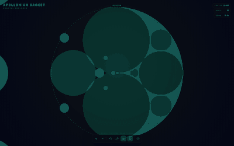

<div align="center">

# Apollonian Gasket

### Infinite zoom. Recursive geometry. Engineered for smooth interaction.

[](https://thelabcorner.github.io/apollonian-gasket/)
[](#rendering-architecture)
[](#run-it)

A high-performance, interactive **Apollonian gasket explorer** built around Descartes' Circle Theorem. Pan, zoom, change palettes, toggle fill modes, and descend into a recursively generated circle packing without turning the browser DOM into the bottleneck.

[**Open the fractal explorer**](https://thelabcorner.github.io/apollonian-gasket/) · [Performance notes](./PERFORMANCE.md) · [Source](./src)

</div>



## What this is

An Apollonian gasket is a fractal circle packing generated by repeatedly filling curvilinear gaps with circles tangent to three existing circles. This project turns that geometry into a responsive, explorable visualization designed to remain usable as recursion depth and visible circle count increase.

The current implementation is intentionally small. There is no framework, no runtime package graph, and no build step required for the deployed explorer.

## Highlights

- **Infinite-feeling zoom** with cursor-centered wheel and pinch interaction
- **Drag-to-pan navigation** with screen-space culling
- **Typed-array geometry buffers** instead of per-circle object allocation
- **Canvas 2D renderer** instead of thousands of live SVG nodes
- **Bounded draw micro-batches** to avoid pathological mega-path tessellation
- **Progressive interaction LOD** with full-detail refinement after input settles
- **Event-driven rendering** with no permanent idle animation loop
- **Precomputed depth palettes** to keep color work off the frame-critical path
- **DPR-aware raster control** to limit high-density display cost
- **Eight color palettes**, fill/outline modes, bounds toggle, keyboard controls, and touch support
- **Zero runtime dependencies**

## Rendering architecture

The original prototype was visually compelling but interaction scaled poorly because each redraw recreated thousands of SVG circle nodes. At deeper views, DOM creation, style calculation, paint invalidation, and garbage collection dominated the actual fractal mathematics.

The optimized architecture keeps the browser workload compact:

```text
input event
    |
    v
coalesced requestAnimationFrame
    |
    +--> camera / viewport state
    |
    +--> typed-array gasket generator
    |       |
    |       +--> screen-space pruning
    |       +--> squared-distance comparisons
    |       +--> bounded recursion / circle budget
    |
    +--> Canvas 2D renderer
            |
            +--> precomputed depth colors
            +--> bounded circle micro-batches
            +--> progressive interaction LOD
```

This shifts the hot path away from DOM mutation and toward predictable arithmetic plus batched raster work.

## Performance

The geometry generator was benchmarked against the original implementation at a 1920 × 1080 viewport. Geometry parity was preserved while reducing generator time by roughly **2.25× to 2.63×** across representative populated views.

| Zoom | Visible circles | Original | Optimized | Speedup |
| ---: | ---: | ---: | ---: | ---: |
| 0.9× | 2,599 | 1.668 ms | 0.652 ms | **2.56×** |
| 2× | 3,076 | 1.600 ms | 0.709 ms | **2.26×** |
| 5× | 3,056 | 1.702 ms | 0.690 ms | **2.47×** |
| 10× | 3,708 | 2.123 ms | 0.807 ms | **2.63×** |

Those figures measure generation only. The larger practical improvement comes from replacing thousands of SVG node mutations with retained Canvas rendering.

See [`PERFORMANCE.md`](./PERFORMANCE.md) for the optimization breakdown.

## Descartes' Circle Theorem

For four mutually tangent circles with signed curvatures `k1`, `k2`, `k3`, and `k4`:

```text
(k1 + k2 + k3 + k4)^2 = 2(k1^2 + k2^2 + k3^2 + k4^2)
```

Given three tangent circles, the theorem yields the curvature of the alternate tangent circle. The explorer recursively applies that relationship, computes circle centers in the complex plane, rejects irrelevant geometry, and writes accepted circles into fixed typed-array buffers for rendering.

## Controls

| Input | Action |
| --- | --- |
| Scroll / pinch | Zoom at cursor |
| Click + drag | Pan |
| `R` | Reset view |
| `C` | Cycle palette |
| `F` | Toggle fill |
| `B` | Toggle bounding circle |
| `?` | Open help |

## Run it

No install is required.

```bash
git clone https://github.com/thelabcorner/apollonian-gasket.git
cd apollonian-gasket
```

Then open `index.html` directly, or serve the folder with any static HTTP server.

```bash
python -m http.server 8080
```

Visit `http://localhost:8080`.

## Project structure

```text
apollonian-gasket/
├── assets/
│   └── preview.png
├── src/
│   ├── app.js
│   └── styles.css
├── .nojekyll
├── index.html
├── PERFORMANCE.md
└── README.md
```

## Design goals

This project intentionally prioritizes:

1. **Interaction latency** over framework convenience
2. **Predictable frame cost** over unbounded visual work
3. **Mathematical parity** over approximation where it is unnecessary
4. **Progressive detail** over freezing the UI to render everything immediately
5. **Small deployment surface** over a large frontend dependency graph

<div align="center">

Built for the joy of zooming into something that never seems to end.

</div>
